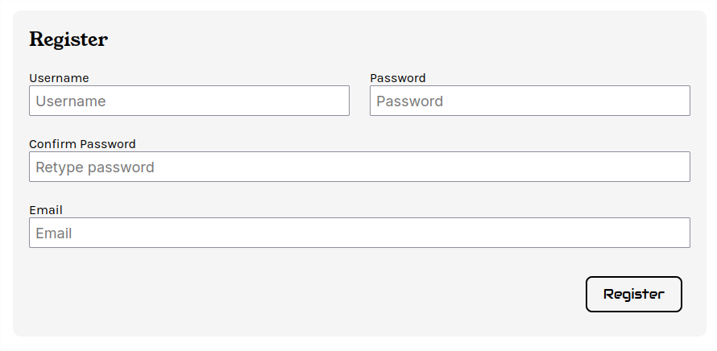
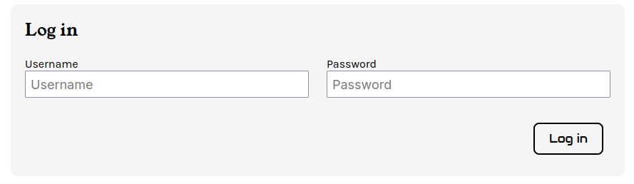
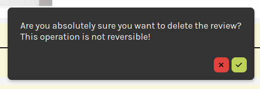

# ReviewAPI
Presentazione del progetto ReviewAPI

:: note ::
Progetto a cura di **Ciro Amato**, [Github](https://github.com/DrKGD)

---
layout: section
color: dark
---

# Introduzione
Presentiamo quali siano gli argomenti di presentazione

---
layout: default
color: dark
---

ReviewAPI è meglio descritta come un sistema di Valutazione per Prodotti commerciali.

<AdmonitionType title="Importante" width="500px" type="warning">
  In quanto trattasi di un progetto <b>proof-of-concept</b>, alcune feature qui di seguito descritte potrebbero
  non essere state implementate.<br/>
  Quantomeno è garantito il funzionamento delle componenti principali richieste.
</AdmonitionType>

Avremo principalmente due categorie utente
- `Editor`, cioè utenti abilitati alla modifica del contenuto, che possano quindi aggiungere,
rimuovere e modificare prodotti e categorie già esistenti.
- `User`, che possono recensire, aggiungere cioè una recensione, al prodotto desiderato.

Permetteremo comunque agli utenti `GUEST` di visionare i prodotti disponibili impedendo loro, però,
di aggiungere recensioni.

---
layout: side-title
align: rm-lt
titlewidth: is-3
color: dark
---

:: title ::
## Argomenti

:: content ::

Tratteremo i seguenti argomenti:

<v-clicks> 

- Database (MySQL)
- Backend (Java)
- Frontend (Angular)
- Deployment con Docker (e Mise)
- Infine alcune considerazioni finali e/o guida alla risoluzione di eventuali problemi

</v-clicks>

---
layout: section
color: dark
---

# MySQL
Spiegazione dettagliata delle tabelle utilizzate.

---
layout: side-title
align: rm-lm
titlewidth: is-3
color: dark
---

:: title :: 
## MySQL

:: content ::
L'applicazione fa uso di [MySQL DBMS](https://www.mysql.com/) per l'immagazzinamento delle informazioni.

Per l'implementazione di quest'applicazione sono state necessarie diverse SQL tables per la rappresentazione
delle entità individuate.

La creazione del database e delle tabelle, nonchè il loro popolamento con dei dati iniziali, 
avviene tramite uno script di installazione SQL, che vedremo in seguito.

---
layout: default
color: dark
---

# SQL: Creazione delle tabelle

<v-switch>
  <template #0-4> 
    Innanzitutto abbiamo le tabelle circa l'implementazione dei prodotti commerciali in se.
    <div style="height: 20px"/>
  </template>
  <template #4-6> 
    Quindi delle tabelle supplementari che serviranno all'implementazione delle funzionalità richieste.
    <div style="height: 20px"/>
  </template>
  <template #1>
  La categoria, dove verrebbe catalogato cioè il prodotto.

  ```sql
  CREATE TABLE Category (
      id			INT AUTO_INCREMENT PRIMARY KEY,
      name			VARCHAR(64) NOT NULL
  );
  ```
  </template>
  <template #2>
  Le tabelle che rappresentano un prodotto, quindi le immagini che lo raffigurano.

  ```sql
  CREATE TABLE Product (
  	id				INT AUTO_INCREMENT PRIMARY KEY,
  	name			VARCHAR(64)		NOT NULL,
  	description		VARCHAR(512)	NOT NULL,
  	price			DECIMAL(8,2)	NOT NULL
  );
  
  CREATE TABLE ProductImage (
  	id				INT AUTO_INCREMENT PRIMARY KEY,
  	id_product		INT NOT NULL,
  	path			VARCHAR(256)	NOT NULL,
  	nth				INT NOT NULL,
  	CONSTRAINT UC_Order UNIQUE (id_product, nth),
  	CONSTRAINT FOREIGN KEY (id_product) REFERENCES Product(id) ON DELETE CASCADE
  );
  ```
  </template>
  <template #3>
  I singoli prodotti possono appartenere a più di una categoria, la tabella <b>Tag</b> associa
  un Prodotto ad una o a più categorie.

  ```sql
  CREATE TABLE Tag (
  	id				INT AUTO_INCREMENT PRIMARY KEY,
  	id_category		INT NOT NULL,
  	id_product		INT NOT NULL,
  	CONSTRAINT FOREIGN KEY (id_category) REFERENCES Category(id) ON DELETE CASCADE,
  	CONSTRAINT FOREIGN KEY (id_product) REFERENCES Product(id) ON DELETE CASCADE
  );
  ```
  </template>
  <template #4>
  La tabella rappresenta l'utenza registrata, quindi memorizzeremo
  informazioni in chiaro (plain-text) quali username, email che possano rappresentarlo.

  ```sql
  CREATE Table User (
  	id				INT AUTO_INCREMENT PRIMARY KEY,
  	username		VARCHAR(64) NOT NULL UNIQUE,	
  	role			ENUM('user', 'editor') NOT NULL,
  	email			VARCHAR(256) NOT NULL UNIQUE,
  	salt			VARCHAR(32) NOT NULL UNIQUE,
  	secret			VARCHAR(128)	NOT NULL
  );
  ```

  Inoltre, per l'implementazione di un sistema di login funzionante, faremo uso
  di <b>Argon2</b>, dove ad ogni utenza corrisponde una password in formato hash generata
  unendo un salt e una password selezionata dall'utente stesso.
  </template>
  <template #5>
  Una recensione è inserita da un utente per uno specifico prodotto, la data
  di inserimento e la data di modifica forniscono informazioni aggiuntive circa
  la recensione stessa.

  ```sql
  CREATE Table Review (
  	id				INT AUTO_INCREMENT PRIMARY KEY,
  	id_product		INT NOT NULL,
  	id_user			INT NOT NULL,
  	rating			DECIMAL(3,2) NOT NULL,
  	short_note		VARCHAR(128) NOT NULL,
  	note			VARCHAR(2048) NOT NULL,
  	date			DATETIME NOT NULL DEFAULT CURRENT_TIMESTAMP,
  	last_modified	DATETIME NOT NULL DEFAULT CURRENT_TIMESTAMP ON UPDATE CURRENT_TIMESTAMP,
  	CONSTRAINT FOREIGN KEY (id_product) REFERENCES Product(id) ON DELETE CASCADE,
  	CONSTRAINT FOREIGN KEY (id_user) REFERENCES User(id) ON DELETE CASCADE
  );
  ```
  </template>
</v-switch>

---
layout: section
color: dark
---

# Backend
Sviluppato in Java, utilizzando design patterns conosciuti.

---
layout: side-title
align: rm-lm
titlewidth: is-3
color: dark
---

:: title ::
# Librerie
### Esterne

:: content ::
Alcune funzionalità lato backend sono state implementate tramite l'utilizzo di librerie
rinomate per la loro stabilità e semplicità di utilizzo.

<v-clicks> 

- Hikari, per la creazione e la gestione di una datapool di connessioni al database.
- Jackson, per la codifica e la decodifica delle informazioni inviate e ricevute al frontend in un
formato JSON, tramite l'utilizzo di semplici annotations da aggiungere alle classi `model` implementate.
- BouncyCastle, un package contenente fondamentalmente le implementazioni crittografiche
degli algoritmi più utilizzati.

</v-clicks>

---
layout: default
color: dark
---

# Hikari
Fondamentalmente una libreria che generalizza le connessioni al database e le incapsula, provvedendo
un pool di connessioni gestito autonomamente all'occorrenza.

```java
// Configuriamo il pool di connessioni al database
// Il JDBCUrl è una stringa da me parametrizzata, che si compone delle seguenti informazioni
// DBHost: L'host su cui risiede il database, l'endpoint
// DBPort: La porta aperta alle connesioni del database
// DATABASE: Il database, in questo specifico caso ReviewAPI
dataConfig = new HikariConfig();
    dataConfig.setJdbcUrl(String.format(URL, DBHost, DBPort, DATABASE));
    dataConfig.setUsername(USER);
    dataConfig.setPassword(DBPassword);
    dataConfig.setMaximumPoolSize(DBPoolSize);

// Inizializziamone le risorse
dataSource = new HikariDataSource(dataConfig);

// Aggiungiamolo al contesto dell'applicazione
ServletContext context = sce.getServletContext();
    context.setAttribute("dataSource", dataSource);

```

---
layout: default
color: dark
---

# Jackson
Diamo un rapido sguardo alle annotazioni disponibili, ad esempio per la classe di modello `Product`.<br/>
Essenzialmente, quando ne richiameremo il JsonBuilder, i singoli campi annotati saranno automaticamente
convertiti in un oggetto `JSON`.

```java
package model;
@JsonPropertyOrder({ "id", "name", "description", "price" })
public class Product {
	@JsonProperty("id")
	Integer id;

	@JsonProperty("name")
	String name;

	@JsonProperty("description")
	String description;

	@JsonProperty("price")
	BigDecimal price;
}
```

---
layout: default
color: dark
---

# BouncyCastle
Fondamentalmente richiamata come un'utility, ci permette di generare un hash in un algoritmo robusto conosciuto
quale `Argon2` specificando i parametri richiesti necessari.

```java
// Un byte array che conterrà l'hash
byte[] hash = new byte[hashLength];

// Configuriamo il generatore Argon2 tramite un builder andando a specificare
// **Il modello e la versione** (Argon2id, v13)
// **Il numero di passaggi** (iterazioni), maggiore il numero, più forte la chiave
// **La memoria associata alla risorsa**
// **Il sale** che verrà utilizzato, per questioni di sicurezza dovrà essere unico per ogni utente.
// **Il numero di core** associato alla risorsa.
Argon2Parameters.Builder builder = 
    new Argon2Parameters.Builder(Argon2Parameters.ARGON2_id)
        .withVersion(Argon2Parameters.ARGON2_VERSION_13)
        .withIterations(iterations)
        .withMemoryAsKB(memlimit)
        .withSalt(Base64.getDecoder().decode(salt))
        .withParallelism(parallelism);

// Infine generiamo l'hash: salt e hash ottenuto saranno codificati in Base64 per il salvataggio nel database.
Argon2BytesGenerator gen = new Argon2BytesGenerator();
    gen.init(builder.build());
    gen.generateBytes(secret.getBytes(StandardCharsets.UTF_8), hash, 0, hash.length);
```

---
layout: side-title
align: rm-lm
titlewidth: is-3
color: dark
---

:: title ::
# Organizzazione
## di progetto:
#### Subprojects

:: content ::
L'organizzazione del progetto segue uno schema rigido che ne permette l'immediata 
navigazione all'interno del codice sorgente
 
Il codice è suddiviso in due sotto-progetti, `shared` e `ReviewAPI`.

<v-clicks>

- `shared` si compone di funzionalità riutilizzabili, perlopiù di interfacce e classi
possibilmente comuni anche ad altri progetti

- `ReviewAPI` si caratterizza delle sole classi che non possono essere scinte dal contesto
dell'applicazione: parliamo fondamentalmente dei modelli di dati e della logica di business
che appatengono esclusivamente al deployment applicazione.

</v-clicks>

---
layout: side-title
align: rm-lm
titlewidth: is-3
color: dark
---

:: title ::
# Organizzazione
## di progetto:
#### I packages

:: content ::
I singoli subprojects consistono di un'organizzazione più lasca ma sempre con un certo grado di
rigidità.

Il codice si suddivide in packages, ognuno dei quali ha obbiettivi ben precisi, che vedremo
per ordine logica (e cronologica) di implementazione, in quanto ognuno dei successivi dipenderà
**strettamente** dal precedente.

---
layout: default
color: dark
---

# Descrizione sui packages disponibili
In breve, vediamone una descrizione.

<v-clicks>

- `model` contiene esclusivamente *una vista* delle informazioni da inviare (o ricevere) all'utente
o per il salvataggio delle informazioni nel database.
È possibile, cioè, avere più model per una stessa tabella SQL o per una stessa Servlet.
- `dao`, è il componente fondamentale di questa implementazione. <br/>
Fondamentalmente ha un solo scopo: aumentare l'astrazione, nel codice, delle operazioni CRUD.
- `service`, si compone della sola logica di business, cioè della verifica,
quindi retrival e del salvataggio delle informazioni per mezzo dei dao.
- `servlet`, gli endpoint *richiamabili* direttamente per l'ottenimento delle informazioni,
utilizza i servizi per mezzo di **dependency injection** dal contesto dell'applicazione.
- `security`, un package autodescrittivo che si compone di tutta quella logica di business
security critical, come la generazione di hash per mezzo di Argon2

</v-clicks>

<v-click>
  Diamo ora una mini-guida al visionamento del codice sorgente, spiegando fondamentalmente
  cosa ci si potrà individuare nei rispettivi packages.
</v-click>

---
layout: default
color: dark
---

# Model
Il model è fondamentalmente una classe Java concreta e annotata per mezzo di Jackson, che 
si compone di uno o più costruttori, di getters e setter pubblici e possibilmente di codice
aggiuntivo.

```java
@JsonPropertyOrder({ "id", "id_category", "id_product" })
public class TagDTO {
	@JsonProperty("id")
	Integer id;

	@JsonProperty("id_category")
	Integer category;

	@JsonProperty("id_product")
	Integer product;
    
    // constructors
    // getters & setters
}
```

In questo specifico caso abbiamo appena *mappato* un modello che corrisponde esattamente alla
tabella Tag del database, vista in qualche slide precedente.

---
layout: two-cols-title
color: dark
---

:: title ::
# DAO

Il Data Access Object è un Design Pattern che separa la logica di business dalla persistenza
logica dei dati. Fondamentalmente si compone di query, della loro installazione e preparazione, quindi esecuzione.

In quanto piuttosto simili tra di loro, ho preferito l'implementazione per mezzo di interfacce utility di composizione.

:: left ::

```java
// Definisco un DAO per un modello 
// Salvabile, Selezionabile in massa e Cancellabile
public class TagDAO implements Saveable,  Bulkable,
	Deletable {
	private final DataSource source;

	private static final String GET_ENTRIES = """
		SELECT id as id_tag, id_category, id_product
		FROM Tag
	""";

	private static final String SAVE_ENTRY = """
		INSERT INTO Tag(id_category, id_product)
		VALUES (?, ?)
	""";

	private static final String DELETE_ENTRY = """
		DELETE FROM Tag WHERE id = ?
	""";
}
```

:: right ::

```java
// Definisco un metodo statico con visibilità default
// che si occuperà della mappatura delle entries ottenute
// (così che sia riutilizzabile in altri DAO)
static TagDTO mapResult(ResultSet rs) throws SQLException {
    TagDTO tag = new TagDTO();
        tag.setId(rs.getInt("id_tag"));
        tag.setCategory(rs.getInt("id_category"));
        tag.setProduct(rs.getInt("id_product"));
    return tag;
}

// Implemento il metodo fetchAll che richiama il metodo
// di Bulkable con la query GET_ENTRIES 
// e Mappando i risultati con mapResult
public List<TagDTO> fetchAll() throws DAOException {
    return Bulkable.super.bulk(
      this.source, 
      GET_ENTRIES, TagDAO::mapResult, 
      (stmt) -> { }
    );
}

```

---
layout: two-cols-title
color: dark
---

:: title ::
# Service
Un service si compone della sola logica di business, quindi chiuderà il gap `DAO - Service - Servlet`

Anche in questo caso ho preferito l'implementazione per mezzo di interfacce utility di composizione.

:: left ::
```java
public class TagService implements 
	ServiceSavable,
	ServiceBulkable,
	ServiceDeletable {

    // Il Service così come il DAO sono registrati
    // nel contesto dell'applicazione
	public TagService(TagDAO dao) {
		this.dao = dao;
	}

    // Richiamo la funzionalità dao implementata 
	public List<TagDTO> fetchAll() throws RuntimeException {
		return ServiceBulkable.super.bulk(this.dao, 
          (dao) -> dao.fetchAll()
        );
	}

    // ... Altri metodi simili ...
}
```

:: right ::

```java
public interface ServiceBulkable{
	default <T, DAO extends Bulkable> List<T> bulk(DAO dao, 
ThrowingFunction<DAO, List<T>, DAOException> bulk) throws 
RuntimeException {
		try { 
			return bulk.apply(dao);
		}

		catch (DAOException e) {
			throw new RuntimeException("Failed in fetching: " + 
            e.getMessage(), e);
		}
	}
}
```

---
layout: two-cols-title
color: dark
---

:: title ::
# Servlet
La servlet è una classe che implementa l'endpoint responsabile delle richieste HTTP
ricevute dall'applicazione.

Ad ogni servlet è associato un servizio, ottenuto per mezzo di dependency injection dal contesto
dell'applicazione.

:: left ::
```java
// Questa servlet risponderà alle request /api/tag
// e sub-endpoints /api/tag/any
@WebServlet(urlPatterns = { "/api/tag", "/api/tag/*" })
public class TagServlet extends HttpServlet implements 
	JSONServletBulkable,
	ServletDelete,
	JSONServletSave {

	private TagService tagService;

	@Override
	public void init() throws ServletException {
        // Richiedo al context dell'applicazione
        // il servizio "Tag" definito precedentemente
		this.tagService = (TagService)
          getServletContext().getAttribute("tagService");
	}

    // ...
}
```

:: right ::

```java
// Rispondo alla chiamata di metodo GET /api/tag
// Tutte le altre sono da considerarsi errate (Bad Request)
@Override
protected void doGet(HttpServletRequest req, 
  HttpServletResponse resp) throws 
  ServletException, IOException {
    String pathInfo = req.getPathInfo();

    if(pathInfo == null || ("/").equals(pathInfo)) {
        JSONServletBulkable.super.bulk(req, resp, 
            (Void)	-> null, 
            (id)	-> this.tagService.fetchAll());
    }

    else {
        resp.sendError(HttpServletResponse.SC_BAD_REQUEST, 
          "Invalid URL: " + pathInfo);
    }
}
```


---
layout: side-title
align: rm-lm
titlewidth: is-3
color: dark
---

:: title ::
# Filtri

:: content ::
Necessariamente dovremo configurare anche come tali endpoints possano comunicare
con il frontend, parliamo quindi dei filtri.

Un filtro è un componente delle Servlet che **intercetta** le richieste (requests), quindi le risposte
(responses) affinchè queste maneggino correttamente gli attributi di sessione e di comunicazione.


<v-click>
In particolare i due filtri a cui faremo riferimento sono i seguenti.
</v-click>

<v-clicks>

- `CorsFilter`, gestisce le richieste `PreFlight` di connessione, permettendo al frontend di ottenere
la corretta configurazione del CORS (Cross-Origin Resource Sharing), ormai obbligatoria a confermare
l'autenticità delle informazioni inviate dal server.
- `AuthFilter`, maneggia la sessione autorizzando, per mezzo di una step by step whitelist,
le richieste inviatogli dal frontend client laddove necessario.

</v-clicks>

---
layout: default
color: dark
---

# CorsFilter
Con il seguente Filtro, gli headers del responso `HTTP` verranno popolate di attributi
necessari ad identificare il backend.

Dopodichè il controllo passerà al prossimo filtro o alla servlet stessa.

Immaginando ad esempio di effettuare una richiesta `GET` all'endpoint `/api/tag`,
questa sarà ricevuta e gestita in questo ordine:
`CorsFilter -> Filter -> /api/tag Servlet -> GET`

```java
httpResponse.setHeader("Access-Control-Allow-Origin", "http://aja-tomcat:8080");
httpResponse.setHeader("Access-Control-Allow-Methods", "GET, POST, OPTIONS, PUT, DELETE");
httpResponse.setHeader("Access-Control-Allow-Credentials", "true");
httpResponse.setHeader("Access-Control-Allow-Headers",	
  "Origin, Content-Type, Authorization, Access-Control-Allow-Origin");
httpResponse.setHeader("Access-Control-Max-Age", "3600");

// Gestisci **qui** il preflight di ogni servlet 
if ("OPTIONS".equalsIgnoreCase(httpRequest.getMethod())) {
        httpResponse.setStatus(HttpServletResponse.SC_NO_CONTENT);
        return; // Termina la catena: le servlet NON implementano il metodo OPTIONS
}

// Continua con la catena di servlet
chain.doFilter(request, response);
```

---
layout: default
color: dark
---

# AuthFilter
Dopoditutto la sicurezza vera e proria di un'applicazione è da curare perlopiù lato backend.

Un utente malintenzionato potrebbe inviare richieste `HTTP` senza autorizzazione alcuna,
per tale motivo implementiamo il filtro di autenticazione.

<v-switch>
  <template #0>

  In particolare l'implementazione si preoccupa di controllare

  - Che tipo di richiesta sta effettuando il client (GET, POST ...)
  - Se il client è autenticato quindi se ha una sessione attiva (identificata da un cookie `JSESSION`).
  - Che tipologia di autenticazione è stata fornita all'utente (`editor`, `user`)

  </template>
  <template #1>

  ```java
  // Controlla autenticazione utente
  boolean isAuthenticated = session != null && session.getAttribute("user") != null;
  boolean isEditor		= session != null && session.getAttribute("role") == "editor";
  
  // Il metodo è get
  if (method.equals("GET")) { ... }
  
  // Controlla se la richiesta sta venendo effettuata ai metodi di autenticazione
  if(servletPath == null || ("/api/auth").equals(servletPath)) { ... }
  
  // L'utente è autenticato, quindi trattasi di un editor
  if (isAuthenticated && isEditor) { ... }
  
  // L'utente è autenticato e sta effettuando una richiesta POST/DELETE/PUT
  if (isAuthenticated && (method.equals("POST") || method.equals("DELETE") || method.equals("PUT"))) { }

  // Blocca tutte le altre tipologie di richieste con un FORBIDDEN 403
  httpResponse.sendError(HttpServletResponse.SC_FORBIDDEN, "Access denied for unauthenticated users.");
  ```
  
  </template>
</v-switch>

---
layout: side-title
align: rm-lm
titlewidth: is-3
color: dark
---

:: title ::
# Inizializzazione
### del Context

:: content ::
Sebbene sia possibile inizializzare "sul momento" le risorse, è preferibile che queste
vengano create in anticipo e che vengano condivise per tutta la durata di vita dell'applicazione.

È possibile, infatti, tramite un'implementazione concreta dell'interfaccia `ServletContextListner`,
generalizzare e inizializzare tutte le risorse o configurazioni.

<v-clicks>

- La connessione al database (o come in questo caso una pool riutilizzabili di connesione al database)
- Tutti i servizi (TagService, UserService ...)
- Configurazioni riguardanti il cookie di sessione `JSESSION`

</v-clicks>

---
layout: side-title
align: rm-lt
titlewidth: is-3
color: dark
---

:: title ::
# Autenticazione
### con Argon2

:: content ::
Nell'applicazione è uno step fondamentale l'autenticazione utente.

Alcune funzionalità sono infatti `bloccate` fintanto che l'utente non è autenticato.

<div style="height: 30px"/>

<v-switch>
  <template #0>
  Facciamo un esempio completo di autenticazione, descritto e gestito nei seguenti passi. (clicca per continuare)
  </template>
  <template #1>
  1. L'utente si registra, quindi fornisce username, password ed email.
  
  </template>
  <template #2>
  2. La servlet intercetta la richiesta di registrazione.
  
  ```java
  // Register new user
  else if(("/register").equals(pathInfo)) {
      JSONServletSave.super.save(req, resp, RegisterDTO.class, 
          (data) -> userService.saveNewUser(data));
  }
  ```
  </template>
  <template #3>
  3. Richiamiamo il metodo del service responsabile per il salvataggio di un'utenza.

  ```java
  public boolean saveNewUser(RegisterDTO dto) {
      // Verifico che tutti i dati necessari siano stati forniti
      // if(dto.getUsername() == null || dto.getUsername().isBlank())
      // if(dto.getEmail() == null || dto.getEmail().isBlank())
      // if(dto.getPassword() == null || dto.getPassword().isBlank())
  
      // ... Altre verifiche di validazione (email/username già esistenti)
      
      User u = new User();
          u.setUsername(dto.getUsername());
          u.setRole("user");
          u.setEmail(dto.getEmail());
          // Genero randomicamente un sale
          u.setSalt(hasher.generateSalt16Byte());
          // Salvo l'hash della password codificata in Argon2 che usi il sale.
          u.setSecret(hasher.hashSecretWithSalt(dto.getPassword(), u.getSalt()));
      return this.save(u);
  }
  ```
  </template>
  <template #4>
  4. L'utente è registrato, può pertanto effettuare il login.
  
  </template>
  <template #5>
  5. Il controllo passa alla servlet, che richiamerà i rispettivi servizi.

  Dapprima un controllo sulle credenziali inserite (username e password)

  ```java
  // Bad credentials
  if (!userService.validateCredentials(user)){
    jsonResponse.put("kind", "BAD_CREDENTIALS");
    jsonResponse.put("message", "Bad credentials!");
  }
  ```

  Se l'autenticazione ha avuto successo, proseguiremo quindi con l'inizializzazione della sessione,
  collateralmente staremmo anche inizializzando un `JSESSION` cookie
  ```java
  HttpSession session = req.getSession(true);
  session.setAttribute("user", u.getUsername());	// Set user
  session.setAttribute("role", u.getRole());		// Set role
  session.setAttribute("id", u.getId());			// Set id
  session.setMaxInactiveInterval(10 * 60);			// Timeout in 10 minutes
  ```
  </template>
</v-switch>

---
layout: section
color: dark
---

# Frontend
Sviluppato in AngularJS.

---
layout: side-title
align: rm-lm
titlewidth: is-3
color: dark
---

:: title ::
# Organizzazione
## di progetto:
#### Subfolders

:: content ::
Il frontend è organizzato seguendo una struttura gerarica ben definita.


<v-clicks>

- `model`, contiene dei modelli, condivisi tra vari componenti della'applicazione,
delle informazioni trasferite da e verso il backend.
- `component` contiene i componenti di uso comune all'interno dell'applicazione, 
come `cards`, `header`, `footer`, ma anche `toast` e `prompt`
- `service`, contiene i servizi angular, dei componenti predefiniti predisposti all'utilizzo
di observers e alle chiamate ad endpoints per l'intercettazione e invio dei dati.
- `guard` contiene appunto le **guards** che impediscono dinamicamente l'accesso ad alcune
delle pagine qualora non fossero soddisfatte le condizioni.
- `page` che contiene appunto le pagine finite dell'applicazione, si compongono di servizi
e componenti.

</v-clicks>

---
layout: two-cols-title
color: dark
---

:: title ::
# Organizzazione di progetto: chiamate API centralizzate

:: left ::

```ts
export class ApiReviewService {
  private host		= environment.apiHost
  private baseURL = `${this.host}/ReviewAPI`
  private apiURL	= `${this.baseURL}/api`

  constructor(private http: HttpClient) { }

  get<T>(url: string, params?: HttpParams, 
    headers?: HttpHeaders): 
    Observable<T> { }

  post<T>(url: string, body: any, 
    headers?: HttpHeaders): 
    Observable<T> { }

  put<T>(url: string, body: any, headers?: HttpHeaders): 
    Observable<T> { }

  delete<T>(url: string, params?: HttpParams, 
    headers?: HttpHeaders): 
    Observable<T> { } 

  staticURL(url: string): string { }
}
```

:: right ::
Internamente tutti gli altri servizi utilizeranno questo servizio come _utility_.

Così configurato, potremo facilmente installare nuove chiamate al backend, creando
una nuova classe che ne possa richiamare i metodi.

Inoltre l'endpoint dell'host è configurabile dal file di configurazione di progetto `angular.json`
sotto la voce environment: questa feature è tremendamente utile per switchare velocemente dalla
modalità **release** alla modalità **developer** del progetto.

---
layout: two-cols-title
color: dark
---

:: title ::
# Organizzazione di progetto: file environment
L'utilizzo dei [file environment](https://angular.dev/tools/cli/environments) permette di switchare velocemente il contesto dell'applicazione,
in generale possono venire utilizzati per una multitudine di scopi.


:: left ::
In modalità *developer*, predefinito.

```ts
export const environment = {
  apiHost: 'http://localhost:5050'
};
```

:: right ::
In modalità *release*, da usare perlopiù con `ng build`

```ts
export const environment = {
  apiHost: '/backend'
};
```

---
layout: default
color: dark
---

# Servizio di Autenticazione

L'AuthService è forse il servizio fondamentale dell'applicazione, in quanto
- Determinate rotte (`/editor`) non sono accessibili da utenti `guest` e/o utenti normali `user`
- Alcune interfacce cambiano dinamicametne in base al livello di autenticazione (`common-header-component`).
- Alcune funzionalità sono abilitate ai soli utenti registrati (inserimento di review).

---
layout: default
color: dark
---

# Autenticità della Sessione
La verifica di autenticazione è completamente gestita lato `backend`: effetuando
una richiesta all'endpoint `/api/auth`, se il `JSESSION` cookie esiste ed è valido, verrà
prodotto un `AuthResponse` contenente **username**, **id** e **ruolo** utente.

```ts
getAuth() {
  this.api.get<AuthResponse>(`${this.endpoint}`)
    .subscribe({
        next: (response) => {
          switch(response.kind) {
            case "AUTH":
              this.userSubject.next({ username: response.username!, role: response.role!, id: response.id! })
              break;
            default: 
              this.userSubject.next({ role: "guest" })
          }
        },

        error:  (err) => {
          console.error('Could not check for authentication!', err.message);
        }
    })
}
```

---
layout: side-title
align: rm-lm
titlewidth: is-3
color: dark
---

:: title ::
# Codice e Implementazioni

:: content ::
Per terminare quanto concerne il frontend in Angular vorrei soffermarmi
su alcune implementazioni caratteristiche.

<v-clicks> 

- I `Toast` che riportano il risultato di un'operazione.
- I `Prompt` di conferma.
- `NgModel` versus `ReactiveModule`

</v-clicks>

---
layout: two-cols-title
color: dark
---

:: title ::
# Messaggi Toast

:: left ::
Il `toast` è implementato come un servizio: il componente
ne richiama i metodi `showMessage` e `hide`

```ts
export class ToastService {
  // ...
  showMessage(message: string | string[], 
    kind: toastKind = "SUCCESS", 
    timeout: number = 3000): void {
    const messageArray = 
      Array.isArray(message) ? message : [message];
    this.toastKindSubject.next(kind);
    this.messageSubject.next(messageArray);
    this.isVisibleSubject.next(true);
    setTimeout(() => { this.hide(); }, timeout);
  }

  hide(): void {
    this.isVisibleSubject.next(false);
  }
}
```

:: right :: 
La componente grafica sfrutta appieno gli `Observables` per l'implementazione.

```ts
export class CommonToastComponent {
  isVisible$;
  message$;
  kind$;

  constructor(private toastService: ToastService)  { 
    this.isVisible$ = this.toastService.isVisible$;
    this.message$ = this.toastService.message$;
    this.kind$ = this.toastService.kind$;
  }
}
```


---
layout: two-cols-title
color: dark
---

:: title ::
# Prompt di conferma

:: left ::
```ts
export class ConfirmationService {
  // ...
  public showPrompt(message: string | string[]) {
    const messageArray = 
      Array.isArray(message) ? message : [message];
    this.promptSubject.next(messageArray);
    this.isVisibleSubject.next(true);
    return this.emitter$.asObservable().pipe(take(1));
  }

  public hidePrompt(){
    this.isVisibleSubject.next(false);
  }
}
```

:: right ::
Nell'implementazione si assomigliano ai `Toast` messages,
tuttavia forniscono anche una componente interattiva al componente:
l'utente potrà selezionare se confermarne o meno l'operazione.



---
layout: two-cols-title
color: dark
---

:: title ::
# NgModel versus ReactiveModule
Entrambi le librerie AngularJS permettono di costruire form in modo veloce ed efficace.

:: left ::

```html
<div class="autogrid">
  <div class="input">
    <label for="username">Username</label>
    <input name="username" ngModel required 
      id="username" placeholder="Username" />
  </div>

  <div class="input">
    <label for="password">Password</label>
    <input type="password" name="password" ngModel 
      required id="password" placeholder="Password" />
  </div>
</div>
```

Si è preferito l'utilizzo di NgModel laddove i dati richiesti
fossero piuttosto semplici.

:: right ::
Ho altrimenti ampiamente utilizzato i ReactiveModule, che permettono di comporre un validatore
di dati più o meno complesso per mezzo della composizione.


```ts
protected form = new FormGroup({
  username: new FormControl(undefined, 
    [ Validators.required ]),
  password: new FormControl(undefined, 
    [ Validators.required ]),
  confirm_password: new FormControl(undefined, 
    [ Validators.required ]),
  email: new FormControl(undefined, 
    [ Validators.required, Validators.email ]),
}, { validators: [ this.passwordMatchValidator ]})
```

Nella registrazione, infatti, dovremo verificare che
- Tutti i campi siano stati compilati.
- Che l'email sia, appunto, una email valida.
- Che le password corrispondano tra di esse.

---
layout: section
color: dark
---

# Build & Deployment
Processo di build con mise e deployment con docker.

---
layout: default
color: dark
---

# Build: Mise
Mise è un task runner, una tipologia di software che appartiene strettamente alla
famiglia tipo `make`.

<div style="height: 20px"/>

Le feature che mi hanno spinto a provarlo, quindi
ad utilizzarlo anche per il progetto, sono le seguenti:

<v-clicks> 

- L'utilizzo di un formato semplice, il `TOML`, divenuto ormai ampiamente supportato e utilizzato.
- Contestualizzazione tramite delle variabili `vars`
- Definizione di `task` e una buona integrazione con il terminale.
- Definizione di `watcher`, ovvero task che andranno a ripetersi ogni qual volta
determinati files risultino modificati.

</v-clicks>

---
layout: default
color: dark
---

# Deployment: Docker
Sono dell'idea che il miglior modo per distribuire un'applicazione composta da diverse
componenti sia quella di scomporlo in microservizi.

<div style="height: 5px"/>

Ciò garantisce infatti a priori un buon livello di modularità, senza considerevoli
punti a suo sfavore. Essenzialmente ogni microservizio necessiterebbe di un suo speifico `Dockerfile`.

<div style="height: 5px"/>

Per il progetto ho però preferito utilizare l'approccio semplificato, andando ad utilizzare un unico
file `docker-compose` che si preoccupa di recuperare le `immagini-container` necessarie, quindi
di `mountare` le risorse appena compilate dai vari componenti.

<div style="height: 5px"/>

<v-switch> 
  <template #1>
   Specifichiamo di voler utilizzare <b>mysql</b>, quindi specifichiamo
   un mount contenente gli script di inizializzazione.

   ```yaml
    mysql:
      image: mysql:9.1.0
      container_name: aja-mysql
    volumes:
      - ${PWD}/docker/mysql:/docker-entrypoint-initdb.d
   ```
  </template>
  <template #2>
    <b>Tomcat</b> è il backend dall'applicazione.

   ```yaml
    tomcat:
      image: tomcat:11.0.2
      container_name: aja-tomcat
      ports:
        - ${PORT_TOMCAT}:8080
      volumes:
        - ${PWD}/docker/tomcat-webapps:/usr/local/tomcat/webapps:rw
        - ${PWD}/libs:/usr/local/tomcat/lib
   ```
  </template>
  <template #3>
    <b>Httpd</b> compone il frontend della nostra applicazione: nulla
    vieterebbe di distribuire l'applicazione con Angular stesso, ma è meglio
    utilizzare un sistema specializzato a quello scopo con funzionalità aggiuntive (load balancing, reverse proxy).

   ```yaml
    httpd:
      image: httpd:latest
      container_name: aja-apache
      ports:
        - ${PORT_HTTPD}:80
      volumes:
        - ${PWD}/docker/dist:/usr/local/apache2/htdocs
        - ${PWD}/docker/httpd/httpd.conf:/usr/local/apache2/conf/httpd.conf
   ```
  </template>
</v-switch>

---
layout: default
color: dark
---

# Httpd
A proposito di `httpd`, per garantirne il corretto funzionamento è necessario configurare adaguatamente
il reverse-proxy nelle richieste effettuate al backend.

<div style="height: 5px"/>

Il backend configura il CORS per richieste che gli vengono effettuate da
specifici endpoint per questioni di sicurezza.

<div style="height: 5px"/>

```bash
<VirtualHost *:*>
  ProxyPass /backend http://aja-tomcat:8080/
  ProxyPassReverse /backend http:/aja-tomcat:8080/
  
  # Header set Origin "aja-apache"
  ServerName aja-tomcat
</VirtualHost>
```

Intercetteremo ogni richiesta effettuata dal frontend verso il backend, facendole
dunque risultare come richieste del frontend a fronte di quanto detto.

---
layout: default
color: dark
---

# .htaccess
Un'applicazione AngularJS necessita di un'ulteriore configurazione affinchè
le pagine siano raggiungibili: è infatti una single page application,
che gestisce dinamicamente il contenuto tramite javascript.

```bash
<IfModule mod_rewrite.c>
  RewriteEngine On
  RewriteBase /
  RewriteRule ^index\.html$ - [L]
  RewriteCond %{REQUEST_FILENAME} !-f
  RewriteCond %{REQUEST_FILENAME} !-d
  RewriteRule . /index.html [L]
</IfModule>
```

Inserendo il file `.htaccess` con questo contenuto intercetteremo ogni richiesta effettuata 
al frontend dal browser trasformandole nel formato richiesto al funzionamento di AngularJS.

---
layout: default
color: dark
---

# JSESSION

Purtroppo l'applicazione così costruita potrebbe non funzionare su browser recenti in quanto,
per motivi di sicurezza, il token di sessione `JSESSION` non può essere trasferito su connessioni
non sicure (è richiesto cioè l'utilizzo di `HTTPS`)

Dovremo inoltre configurare correttamente il cookie affinchè questo si espliciti
come un cookie provenente da un sito terzo (con `SameSite: None`) e `Secure`

```java
ServletContext context = sce.getServletContext();
  context.getSessionCookieConfig().setAttribute("SameSite", "None");
  context.getSessionCookieConfig().setSecure(true);
  context.getSessionCookieConfig().setHttpOnly(true);
```

Tale configurazione è indicata (_quindi commentata_) nella classe `AppContext`


---
layout: section
color: dark
---

### Grazie per l'attenzione
[Repository del progetto](https://github.com/DrKGD/aja-reviewapi)

